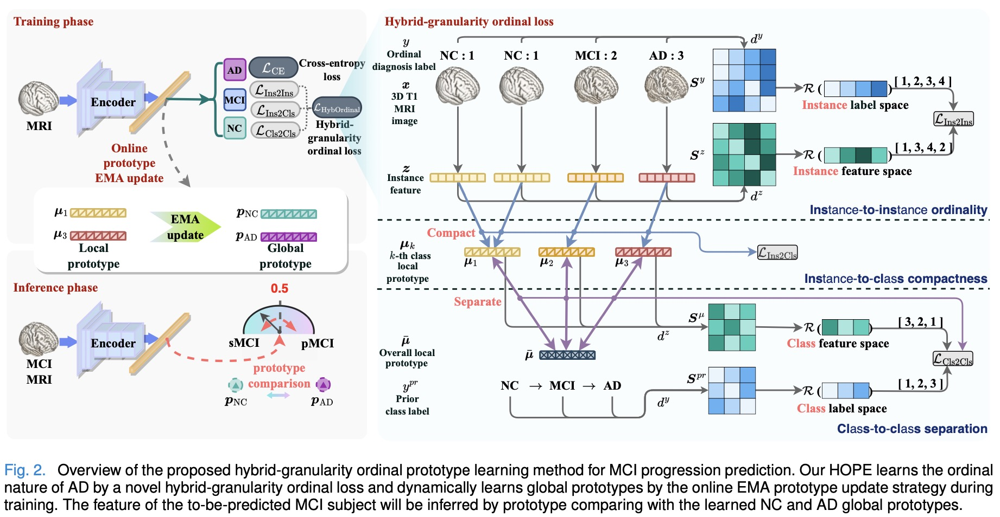
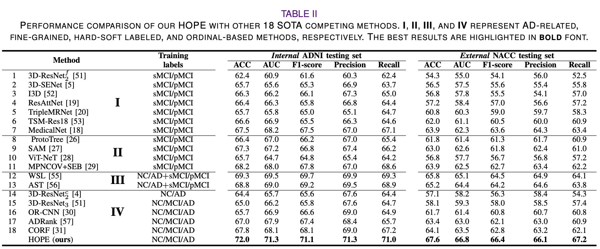
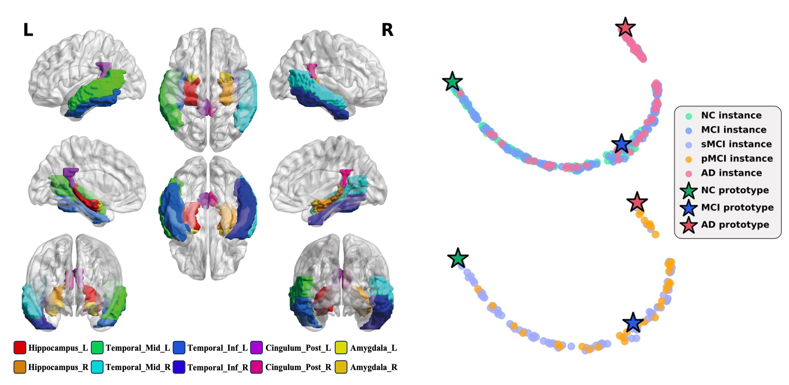

# HOPE for Mild Cognitive Impairment (Kaggle Edition)

This codebase has been optimized for **Distributed Kaggle Execution**. The orchestration scripts (`ablation_loss.py`, `test_ablation_loss.py`, `extract_latent_features.py`) are strictly decoupled, allowing you to train, test, and extract features for specific folds dynamically. 

This enables you to split a 5-fold cross-validation experiment across 5 different Kaggle machines running in parallel without data collisions.

---

## Supported Ablation Variants (`--target_loss`)
When running any of the scripts below, you MUST specify exactly which loss variant you want to run using `--target_loss`, and the number of classes it should be modeled for using `--num_classes`.

**Standard 3-Class Variants (`--num_classes 3`):**
- `ce`: Standard Cross-Entropy only.
- `ins2ins`: CE + Instance-to-Instance contrastive loss.
- `ins2cls`: CE + Ins2Ins + Instance-to-Class compactness.
- `full`: HOPE 3-Class (CE + Ins2Ins + Ins2Cls + Cls2Cls ordinal ranking).
- `exclude_ins2ins`: Ablation excluding Ins2Ins.
- `exclude_ins2cls`: Ablation excluding Ins2Cls.
- `exp_triplet_ins2cls`: Triplet Ins2Cls configuration for 3-class.
- `triplet_only`: Triplet only.
- `hierarchical_triplet_only`: Hierarchical Triplet only.
- `exp_hierarchical_triplet_ins2cls`: Hierarchical Triplet Ins2Cls.

**Extended 4-Class Variants (`--num_classes 4`):**
- `full_4class`: HOPE 4-Class implementation.
- `exp_triplet_ins2cls_4class`: Triplet Ins2Cls extended for 4 classes.

---

## 🚀 The Kaggle Workflow

### Step 1: Training a Specific Fold
To train a specific model variant on a single Kaggle machine, run the following command. The script will train the model and save the best checkpoints for that fold.

```bash
# Example: Training Fold 1 for the 4-Class Triplet Ins2Cls variant
python ablation_loss.py \
    --target_loss exp_triplet_ins2cls_4class \
    --num_classes 4 \
    --specific_fold 1 \
    --data_dir /kaggle/input/datasets/kisokoghan/paired-npz/paired_npz
```

### Step 2: Testing & Generating Metrics CSV
Once training is complete, test the trained checkpoint on the isolated validation set to compute ACC, AUC, F1, Precision, and Recall. This creates `test_metrics_best_{2c/3c/4c}.csv` files in the checkpoint folder.

```bash
# Example: Testing Fold 1 for the 4-Class Triplet Ins2Cls variant
python test_ablation_loss.py \
    --target_loss exp_triplet_ins2cls_4class \
    --num_classes 4 \
    --specific_fold 1 \
    --data_dir /kaggle/input/datasets/kisokoghan/paired-npz/paired_npz
```

### Step 3: Extracting Latent Features for t-SNE
Extract the raw 512-dimensional output vectors for visualization. This script reads the test dataset, passes it through the specified checkpoint, and saves a flattened CSV file.

```bash
# Example: Extracting features for Fold 1 of the 4-Class Triplet Ins2Cls variant
python extract_latent_features.py \
    --target_loss exp_triplet_ins2cls_4class \
    --num_classes 4 \
    --specific_fold 1 \
    --data_dir /kaggle/input/datasets/kisokoghan/paired-npz/paired_npz \
    --out_dir /kaggle/working/extracted_features
```

### Step 4: Zip & Download
To easily download your training checkpoints, test metrics, and extracted feature CSVs from Kaggle to your local machine, zip them directly into the `/kaggle/working` directory.

```bash
# Zip the checkpoints (containing weights and test_metrics CSVs)
zip -r /kaggle/working/checkpoints_fold1.zip ./checkpoints

# Zip the extracted features
zip -r /kaggle/working/features_fold1.zip /kaggle/working/extracted_features
```
You can now download `checkpoints_fold1.zip` and `features_fold1.zip` straight from the Kaggle Data pane!

---

## Local Machine: Aggregating Results

After you have downloaded all your fold zips from Kaggle to your local computer, organize them into your local `checkpoints/` and `analysis_output_tSNE/` folders. 

**Generate Final Tables:**
```bash
# This reads all test_metrics_best_*.csv files across all 5 folds and computes mean ± std.
python analyze_results.py
```

**Generate t-SNE & Density Plots:**
```bash
# Compute 2D t-SNE scatter plots
python plot_tsne.py

# Compute 1D Latent Feature KDE overlaps
python plot_latent_features.py

# Stitch them together into final side-by-side images
python merge_plots.py
```

---

# Original Project Overview: HOPE for Mild Cognitive Impairment

**[JBHI 2024]** This is a code implementation of the **hybrid-granularity ordinal learning** proposed in the manuscript "**HOPE:
Hybrid-granularity Ordinal Prototype Learning for Progression Prediction of Mild Cognitive Impairment**". [[doi]](https://ieeexplore.ieee.org/document/10412338) [[arxiv]](https://arxiv.org/abs/2401.10966)

## Introduction

Existing works typically require **MCI subtype labels**—**progresive MCI** (pMCI) vs. **stable MCI** (sMCI)—determined by whether or not an MCI patient will progress to AD after a period of follow-up diagnosis. However, collecting retrospective MCI subtype data is time-consuming and resource-intensive, which leads to relatively small labeled datasets, resulting in amplified overfitting and challenges in extracting discriminative information.

## Hybrid-granularity ordinal prototype learning

Based on **the ordinal development of AD**, we take a fresh perspective on the extensive cross-sectional data collected
from subjects across all stages of AD, ranging from Normal Cognition (NC) to MCI to AD, as the ''latent'' longitudinal
data specific to the entire AD cohort; the pathological differences between sMCI and pMCI are analogical to those
between NC and AD.
Inspired by this, we propose a novel **Hybrid-granularity Ordinal PrototypE learning** (HOPE) method to predict the
progression of MCI by learning the ordinal nature of AD.

 

## Experimental results

Experimental results on the internal ADNI and external NACC datasets show that the proposed HOPE outperforms recently
published AD-related and ordinal-based state-of-the-art methods and has better generalizability.

 

Moreover, we present data visualization using GradCAM and t-SNE. Our findings indicate that our HOPE has effectively
learned **the ordinal nature of AD development**. Furthermore, we have identified specific regions of interest that are
closely associated with the progression of AD.


